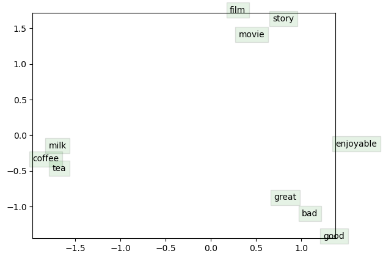

## 4. Visualization

```python
from matplotlib import pyplot as plt


visualize_words = [
    "movie", "film", "story",
    "good", "enjoyable", "great", "bad",
    "coffee", "tea", "milk"
]
plt.show()
```


    

    
```python
for word in visualize_words:
    idx = tokenizer.vocab[word]
    vec = center_vecs[idx]
    indices = knn(vec, center_vecs, 10)
    closed_words = [tokenizer.inverse_vocab[i] for i in indices]
    print('Word: "{}" is close to {}'.format(word, closed_words))
```

    Word: "movie" is close to ['movie', 'film', 'flick', 'movies', 'sequel', 'documentary', 'horror', 'cinema', 'anthology', 'feature']
    Word: "film" is close to ['film', 'movie', 'picture', 'documentary', 'cinema', 'sequel', 'feature', 'flick', 'films', 'rotterdam']
    Word: "story" is close to ['story', 'plot', 'stories', 'storyline', 'premise', 'tale', 'plotline', 'leisurely', 'plots', 'idea']
    Word: "good" is close to ['good', 'great', 'decent', 'bad', 'fine', 'nice', 'excellent', 'amazing', 'exceptional', 'interesting']
    Word: "enjoyable" is close to ['enjoyable', 'entertaining', 'lighthearted', 'middling', 'disappointing', 'fluff', 'escapist', 'hyped', 'verite', 'watchable']
    Word: "great" is close to ['great', 'amazing', 'good', 'wonderful', 'excellent', 'fine', 'awesome', 'nice', 'fantastic', 'exceptional']
    Word: "bad" is close to ['bad', 'terrible', 'horrible', 'awful', 'good', 'lame', 'stupid', 'lousy', 'atrocious', 'crappy']
    Word: "coffee" is close to ['coffee', 'booze', 'drinking', 'milk', 'farm', 'poison', 'pills', 'liquor', 'beer', 'wet']
    Word: "tea" is close to ['tea', 'coffee', 'cocoa', 'camford', 'wine', 'carmine', 'guinea', 'tester', 'manos', 'hassan']
    Word: "milk" is close to ['milk', 'soda', 'frozen', 'sucking', 'fried', 'wet', 'eating', 'bottles', 'cleaning', 'knee']
    


```python

```
